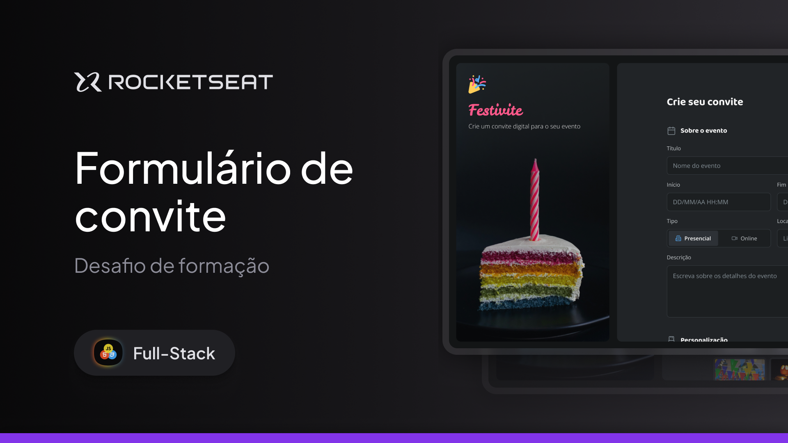

# Formulário de Convite

Um projeto de interface moderna e responsiva para criação de convites, desenvolvido com foco em formulários HTML bem estruturados e estilização com CSS. A proposta é simular a experiência de um usuário preenchendo um convite personalizado de forma intuitiva e visualmente agradável.

## Preview

  

Acesse o projeto online:

[https://seu-link-aqui.github.io/](https://seu-link-aqui.github.io/)

## Sobre o projeto

Este projeto simula a criação de um convite digital por meio de um formulário interativo, onde o usuário pode inserir informações como título do evento, data, horário, local e descrição.

A ideia principal foi reproduzir um formulário moderno, semelhante aos utilizados em plataformas reais, com foco em organização, clareza e experiência do usuário.

O formulário foi estruturado para ser simples de usar, mas ao mesmo tempo visualmente atraente, utilizando boas práticas de layout e hierarquia de informações.

## Funcionalidades

* Formulário completo para criação de convite
* Campos organizados de forma intuitiva
* Inputs estilizados e modernos
* Layout responsivo
* Seleção de opções (como tipo de evento)
* Estrutura clara e bem definida
* Feedback visual em interações (focus/seleção)
* Design limpo e agradável

## Tecnologias utilizadas

* HTML
* CSS

## Objetivo do projeto

O principal objetivo deste projeto foi praticar a construção e estilização de formulários utilizando apenas HTML e CSS.

Durante o desenvolvimento, foram trabalhados conceitos como:

* Estruturação semântica de formulários em HTML
* Estilização de inputs, labels e botões
* Estados de interação (hover, focus, checked)
* Responsividade
* Uso de flexbox e grid
* Organização visual e espaçamento
* Criação de interfaces intuitivas
